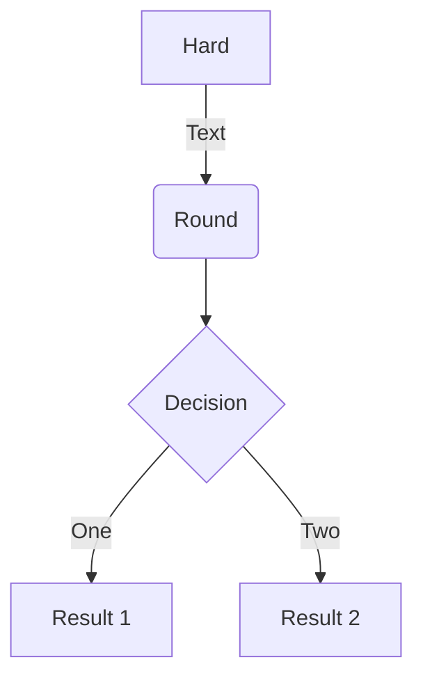
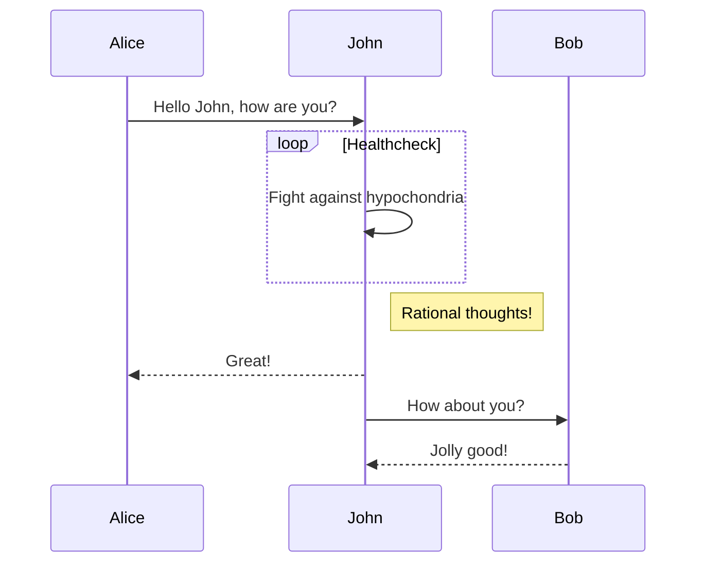
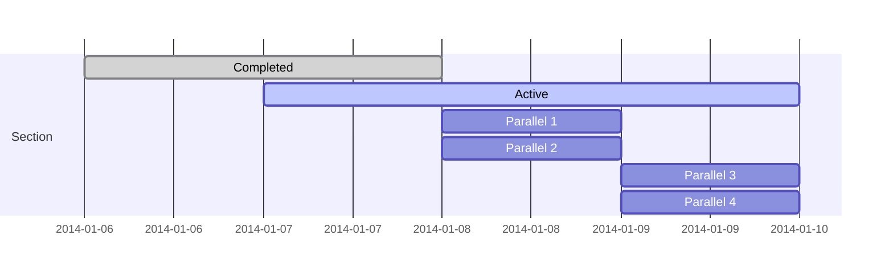
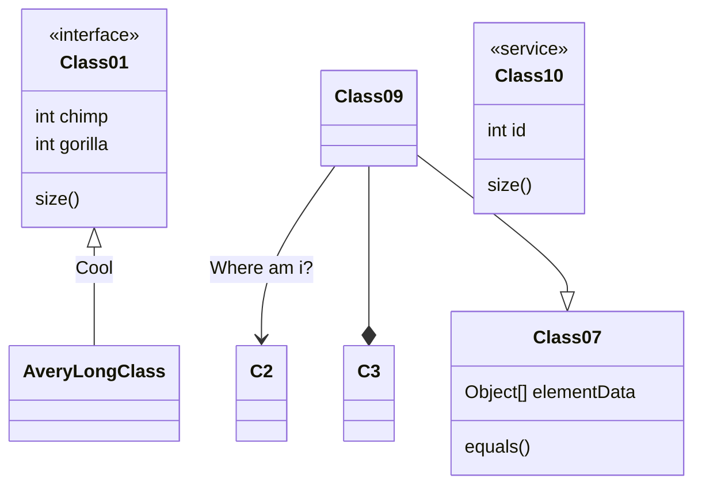
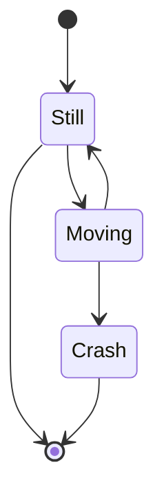
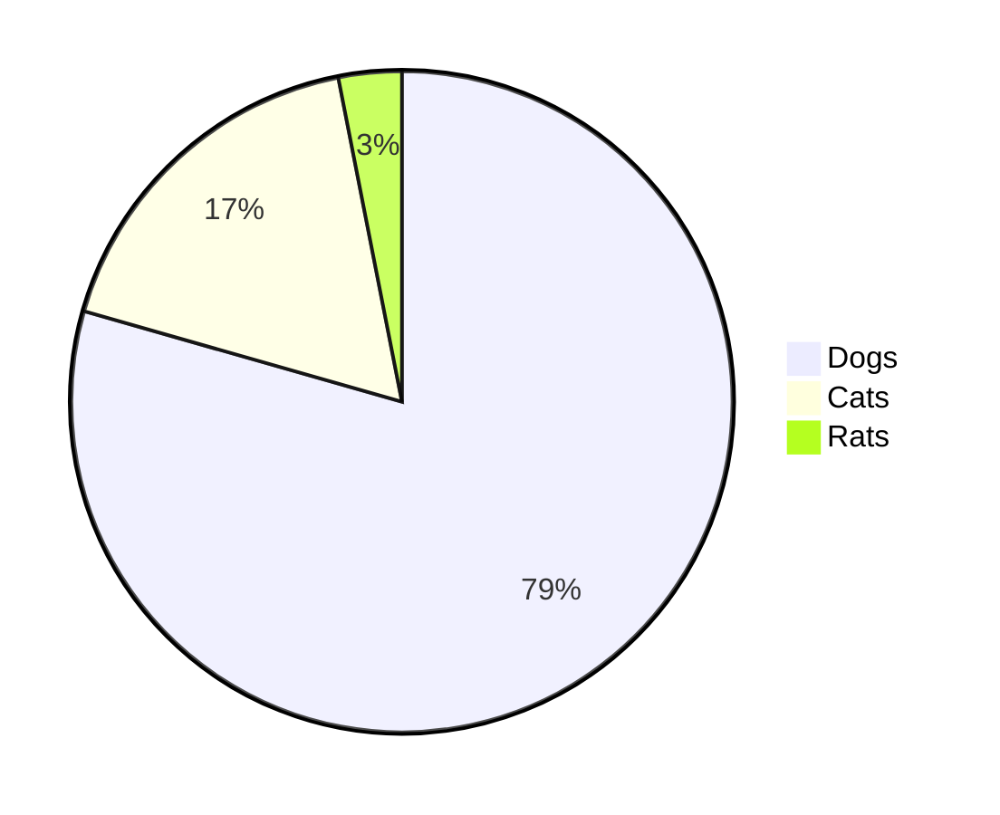
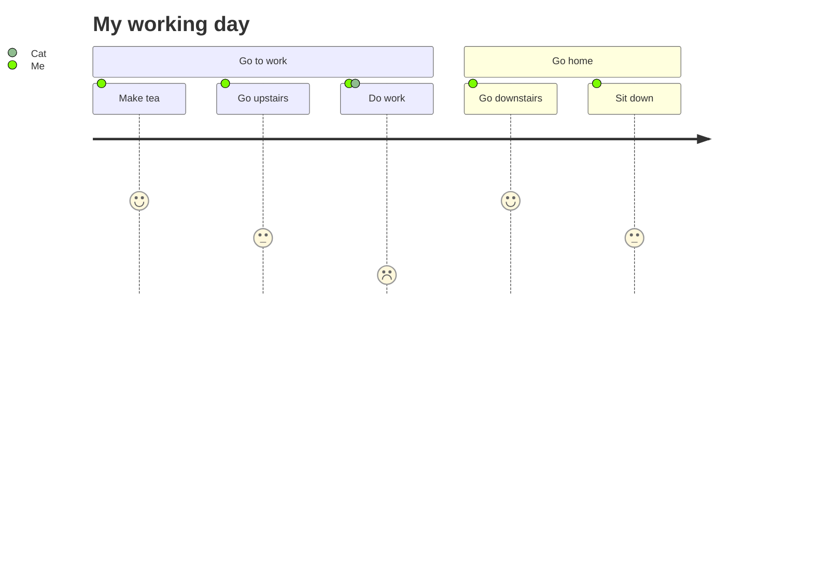

# NexT v8.11增加了对Mermaid的支持
https://theme-next.js.org/next-8-11-0-released/

# 使用方法
升级Hexo到V6.x, 升级NexT版本到V8.11.0，修改NexT配置文件，修改Hexo配置文件。
https://theme-next.js.org/docs/tag-plugins/mermaid.html

# 显示效果

https://github.com/mermaid-js/mermaid
https://github.com/mermaid-js/mermaid/blob/develop/README.zh-CN.md

## 流程图
代码：

<pre>
&#96;&#96;&#96;mermaid
graph TD
A[Hard] --&gt;|Text| B(Round)
B --&gt; C{Decision}
C --&gt;|One| D[Result 1]
C --&gt;|Two| E[Result 2]
&#96;&#96;&#96;
</pre>

显示效果：

<!-- more -->

## 顺序图
代码：

<pre>
&#96;&#96;&#96;mermaid
sequenceDiagram
Alice-&gt;&gt;John: Hello John, how are you?
loop Healthcheck
    John-&gt;&gt;John: Fight against hypochondria
end
Note right of John: Rational thoughts!
John--&gt;&gt;Alice: Great!
John-&gt;&gt;Bob: How about you?
Bob--&gt;&gt;John: Jolly good!
&#96;&#96;&#96;
</pre>

显示效果

## 甘特图
源码：

<pre>
&#96;&#96;&#96;mermaid
gantt
dateFormat  YYYY-MM-DD
section Section
Completed :done,    des1, 2014-01-06,2014-01-08
Active        :active,  des2, 2014-01-07, 3d
Parallel 1   :         des3, after des1, 1d
Parallel 2   :         des4, after des1, 1d
Parallel 3   :         des5, after des3, 1d
Parallel 4   :         des6, after des4, 1d
&#96;&#96;&#96;
</pre>

显示效果：

## 类图
源码：

<pre>
&#96;&#96;&#96;mermaid
classDiagram
Class01 &lt;|-- AveryLongClass : Cool
&lt;&lt;interface&gt;&gt; Class01
Class09 --&gt; C2 : Where am i?
Class09 --* C3
Class09 --|&gt; Class07
Class07 : equals()
Class07 : Object[] elementData
Class01 : size()
Class01 : int chimp
Class01 : int gorilla
class Class10 {
  &lt;&lt;service&gt;&gt;
  int id
  size()
}
&#96;&#96;&#96;
</pre>

显示效果：

## 状态图
源码：

<pre>
&#96;&#96;&#96;mermaid
stateDiagram
[*] --&gt; Still
Still --&gt; [*]
Still --&gt; Moving
Moving --&gt; Still
Moving --&gt; Crash
Crash --&gt; [*]
&#96;&#96;&#96;
</pre>

显示效果：

## 饼图
源码：

<pre>
&#96;&#96;&#96;mermaid
pie
"Dogs" : 386
"Cats" : 85
"Rats" : 15
&#96;&#96;&#96;
</pre>

显示效果:

## 用户体验旅程图journey
源码：

<pre>
&#96;&#96;&#96;mermaid
journey
title My working day
section Go to work
  Make tea: 5: Me
  Go upstairs: 3: Me
  Do work: 1: Me, Cat
section Go home
  Go downstairs: 5: Me
  Sit down: 3: Me
&#96;&#96;&#96;
</pre>

显示效果：

