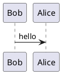
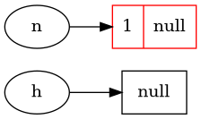

# Hexo 使用plantuml

## hexo-filter-plantuml
```
npm install hexo-filter-plantuml --save 
```

这个插件支持，使用markdown代码块来绘图，语言选择plantuml即可:

<pre>
&#96;&#96;&#96;plantuml
&#64;startuml
Bob-&gt;Alice : hello
&#64;enduml
&#96;&#96;&#96;
</pre>

显示效果：


<!-- more -->

<pre>
&#96;&#96;&#96;plantuml
&#64;startdot
digraph demo {
  rankdir=LR;
  node [shape=record];
  h [shape=ellipse];
  n [shape=ellipse];

  a [label="{1|null}" color="red"];

  h -&gt; null;
  n -&gt;a;
}
&#64;enddot
&#96;&#96;&#96;
</pre>

显示效果



## hexo-filter-krok插件
```
npm install hexo-filter-kroki --save
```
这个插件是上面的插件`hexo-filter-plantuml`的升级版本，不仅支持plantuml图，还支持其他的绘图方式。

本来我使用的时候这个插件，但是最近，我使用的时候，执行hexo g,hexo s等命令会卡死。所以我使用的是上一个插件。
这个插件功能比较多，也可以试试这个插件。

# 参考资料
https://zhangxueren.club/2019/11/plantUML.html
https://itopic.org/graphviz.html

https://www.npmjs.com/package/hexo-filter-plantuml
https://www.npmjs.com/package/hexo-filter-kroki

https://github.com/miao1007/hexo-filter-plantuml
https://github.com/miao1007/hexo-filter-kroki

https://kroki.io/examples.html
