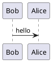
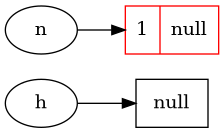
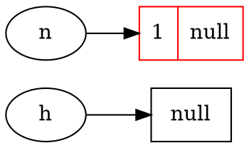

# Hexo 使用plantuml

推荐使用hexo-filter-krok插件，这个插件功能强大，支持的语法也多。
使用如下命令进行安装：
```
npm install hexo-filter-kroki --save
```
然后使用markdown代码块来绘图：


<pre>
&#96;&#96;&#96;plantuml
&#64;startuml
Bob-&gt;Alice : hello
&#64;enduml
&#96;&#96;&#96;
</pre>

显示效果：



<pre>
&#96;&#96;&#96;plantuml
&#64;startdot
digraph demo {
  rankdir=LR;
  node [shape=record];
  h [shape=ellipse];
  n [shape=ellipse];

  a [label="{1|null}" color="red"];
  
  h -&gt; null;
  n -&gt;a;
}
&#64;enddot
&#96;&#96;&#96;
</pre>

显示效果



<pre>
&#96;&#96;&#96;graphviz
digraph demo {
  rankdir=LR;
  node [shape=record];
  h [shape=ellipse];
  n [shape=ellipse];

  a [label="{1|null}" color="red"];
  
  h -&gt; null;
  n -&gt;a;
}
&#96;&#96;&#96;
</pre>

显示效果：



## 插件2：hexo-filter-plantuml
```
npm install hexo-filter-plantuml --save 
```
需要注意的时候，这个插件好像和上面的`hexo-tag-plantuml`插件冲突，如果要使用`hexo-filter-plantuml`插件，则先卸载掉`hexo-tag-plantuml`插件。
这个插件支持，使用markdown代码块来绘图，语言选择plantuml即可:

<pre>
&#96;&#96;&#96;plantuml
&#64;startuml
Bob-&gt;Alice : hello
&#64;enduml
&#96;&#96;&#96;
</pre>

显示效果：


## hexo-filter-krok插件
```
npm install hexo-filter-kroki --save
```
这个插件是上面的插件`hexo-filter-plantuml`的升级版本，既支持上面的标签写法，也支持代码块写法。
而且该插件支持的语法挺多的，强烈建议使用该插件。
# 参考资料
https://zhangxueren.club/2019/11/plantUML.html
https://itopic.org/graphviz.html

https://www.npmjs.com/package/hexo-filter-plantuml
https://www.npmjs.com/package/hexo-filter-kroki
https://kroki.io/examples.html
