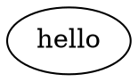
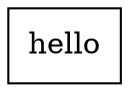
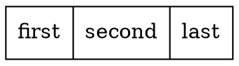
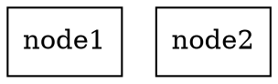
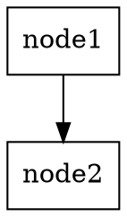
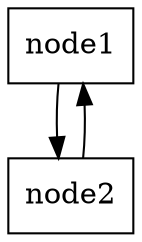
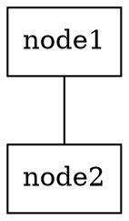

# dot学习1
## 包含一个"hello"的图形

```
digraph {
    hello
}
```

显示效果



<!--  -->

```

```

这样写时不行的，还需要进行URL编码：

```

```

渲染效果如下:


## 调整图形形状

graphviz支持很多的图形形状，完整列表可以参考
https://www.graphviz.org/doc/info/shapes.html

按类别可以分成两类，
- 一类是正方形、圆形等几何形状，
- 另一类是表格(Record Node)

### 几何图形
比如把上面"hello"这个椭圆形改成正方形，使用语法shape=box即可

```
digraph {
    hello [shape=box];
}
```

显示效果



### 表格

```
digraph {
    hello [shape=record label="first|second|last"];
}
```

显示效果如下



### 节点关系
#### 定义两个节点

```
digraph {
    node1 [shape=box];
    node2 [shape=box];
}
```

显示效果



#### 有向图 单向 node1 -> node2

```
digraph {
    node1 [shape=box];
    node2 [shape=box];
    node1 -> node2;
}
```

显示效果：



#### 有向图 双向 node1 -> node2 node2 -> node1

```
digraph {
    node1 [shape=box]
    node2 [shape=box]
    node1 -> node2
    node2 -> node1
}
```

显示效果



#### 无向图 node1 -- node2

```
graph {
    node1 [shape=box]
    node2 [shape=box]
    node1 -- node2
}
```

显示效果



# 参考资料
https://juejin.cn/post/6844903942883655687
