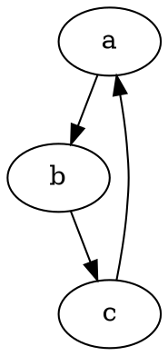
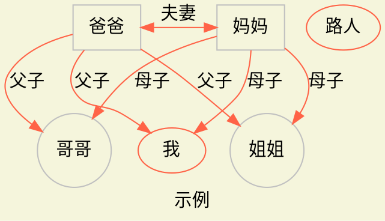
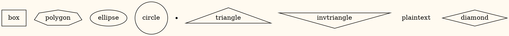
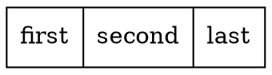

# 使用vscode

## 安装Graphviz Markdown Preview插件

# dot语法
## 有向图

```
digraph g {
    a->b;
    b->c;
    c->a;
}
```

如下图所示：


## 代码示例

```
#@startdot
digraph demo {
    label="示例"
    bgcolor="beige"
    node[color="grey"]
    father[label="爸爸", shape="box"]
    mother[label="妈妈", shape="box"]
    brother[label="哥哥", shape="circle"]
    sister[label="姐姐", shape="circle"]
    node[color="#FF6347"]
    strangers[label="路人"]
    edge[color="#FF6347"]
    father->mother[label="夫妻", dir="both"]
    father->brother[label="父子"]
    father->sister[label="父子"]
    father->我[label="父子"]
    mother->{brother,sister,我}[label="母子"]
    {rank=same; father, mother}
    {rank=same; brother,sister,我}
}
#@enddot
```

显示效果



## shape示例
代码：

```
digraph demo {
    bgcolor="floralwhite"
    "box"[shape=box]
    "polygon"[shape=polygon,sides=7] 
    "ellipse"[shape=ellipse]
    "circle"[shape=circle]
    "point"[shape=point]
    "triangle"[shape=triangle]
    "invtriangle"[shape=invtriangle]
    "plaintext"[shape=plaintext]
    "diamond"[shape=diamond]
}
```

显示效果：



## 矩形
```
digraph {
    hello [shape=record label="first|second|last"]
}
```


