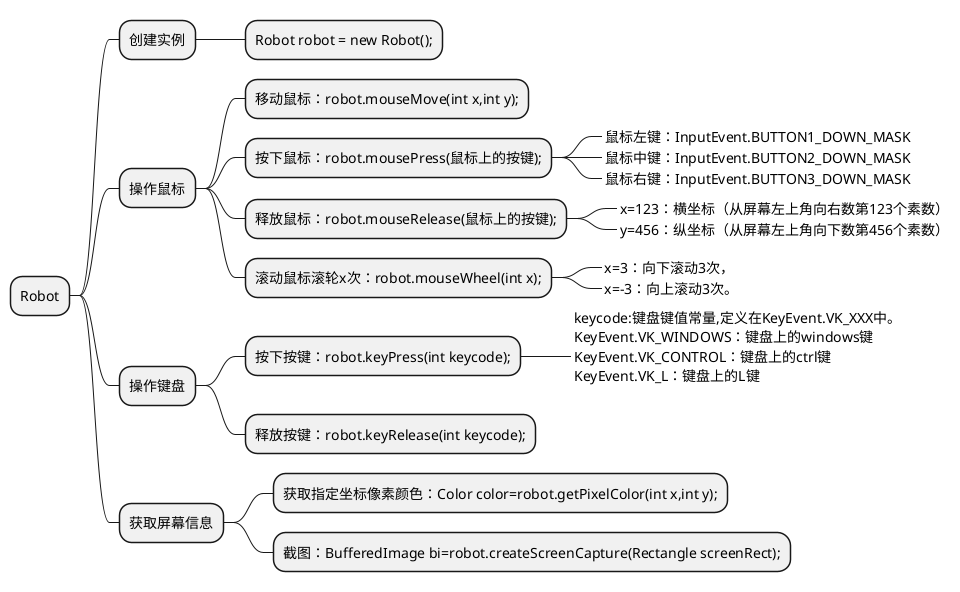

# 概述
Java中Robot类位于java.awt.Robot，该类用于为测试自动化，自运行演示程序和其他需要控制鼠标和键盘的应用程序,生成本机系统输入事件.

Robot可以模拟鼠标和键盘的输入，相当于Java版的按键精灵。

## 1.创建实例
```java
Robot robot = new Robot();
```
## 延时函数
```java
robot.delay(毫秒值);
```
## 操作鼠标
### 鼠标移动
```java
//鼠标移动到指定位置
robot.mouseMove(int x,int y);
```
### 鼠标按下
```java
robot.mousePress(鼠标上的按键);
//鼠标左键：InputEvent.BUTTON1_DOWN_MASK
//鼠标中键：InputEvent.BUTTON2_DOWN_MASK
//鼠标右键：InputEvent.BUTTON3_DOWN_MASK
```
### 鼠标释放
```java
robot.mouseRelease(鼠标上的按键);
//鼠标左键：InputEvent.BUTTON1_DOWN_MASK
//鼠标中键：InputEvent.BUTTON2_DOWN_MASK
//鼠标右键：InputEvent.BUTTON3_DOWN_MASK
```
### 鼠标滚轮滑动
```java
//鼠标滚动（参数wheelAmt表示滚动的次数，参数小于0，表示向上滚动；参数大于0，表示向下滚动）
robot.mouseWheel(int wheelAmt);
```

## 操作键盘
### 键盘按下指定的键
```java
//键盘按下指定的键-----keycode:键盘键值常量，定义在KeyEvent.VK_XXX 中
//KeyEvent.VK_WINDOWS:键盘上的windows键
//KeyEvent.VK_CONTROL：键盘上的ctrl键
//KeyEvent.VK_L：键盘上的L键
robot.keyPress(int keycode);
```
### 键盘释放指定的键
```java
//键盘按下指定的键-----keycode:键盘键值常量，定义在KeyEvent.VK_XXX 中
//KeyEvent.VK_WINDOWS:键盘上的windows键
//KeyEvent.VK_CONTROL：键盘上的ctrl键
//KeyEvent.VK_L：键盘上的L键
 
robot.keyRelease(int keycode);
```
## 获取屏幕信息
### 获取屏幕指定坐标处像素颜色
```java
//获取指定坐标处的像素颜色
Color color=robot.getPixelColor(int x,int y);
```
### 截取指定区域的图像（截图功能）
```java
//获取指定矩形区域的图像（截图）
BufferedImage bufferedimage=robot.createScreenCapture(Rectangle screenRect);
```
## 控制类方法
```java
//睡眠指定的时间，相当于Thread.sleep(long ms);
robot.delay(int ms);

//在处理完当前事件队列只的所有事件之前，一直等待
robot.waitForIdle();
 
//设置此robot在生成一个事件后是否自动调用waitForIdle(),设置为true，表示添加的事件逐个按顺序执行
robot.setAutoWaitForIdle(boolean isOn);
 
//设置此robot每在生成一个事件后自动睡眠的毫秒数
robot.setAutoDelay(int ms);
```

## 示例
### 示例：截取指定矩形区域的图像，并保存到指定的路径
```java
public static void main(String[] args) throws AWTException, IOException {
    Robot robot=new Robot();
    //获取指定矩形区域的屏幕图像
    BufferedImage bufferedImage=robot.createScreenCapture(new Rectangle(100,100,500,500));
    File f=new File("D:\\save.jpg");
    OutputStream os=new FileOutputStream(f);
    ImageIO.write(bufferedImage, "jpg", os);
}
```
### 示例：在指定区域自动输入指定字符
```java
robot.mouseMove(342, 626);
robot.mousePress(InputEvent.BUTTON1_DOWN_MASK);
robot.mouseRelease(InputEvent.BUTTON1_DOWN_MASK);
robot.delay(500);
        
robot.keyPress(KeyEvent.VK_L);
robot.keyRelease(KeyEvent.VK_L);
robot.delay(500);
        
robot.keyPress(KeyEvent.VK_O);
robot.keyRelease(KeyEvent.VK_O);
robot.delay(500);
        
robot.keyPress(KeyEvent.VK_V);
robot.keyRelease(KeyEvent.VK_V);
robot.delay(500);
        
robot.keyPress(KeyEvent.VK_E);
robot.keyRelease(KeyEvent.VK_E);
robot.delay(500);
```
# 总结

