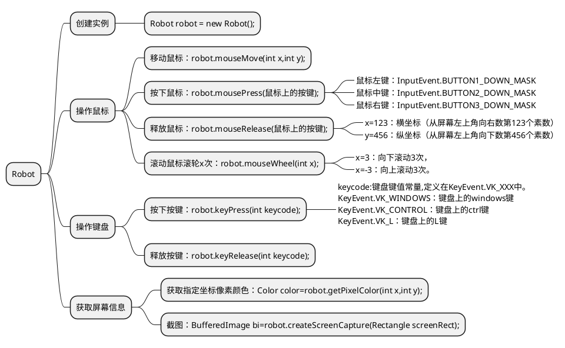

```plantuml
@startmindmap
* Robot
** 创建实例
*** Robot robot = new Robot();
** 操作鼠标
*** 移动鼠标：robot.mouseMove(int x,int y);
*** 按下鼠标：robot.mousePress(鼠标上的按键);
****_ 鼠标左键：InputEvent.BUTTON1_DOWN_MASK
****_ 鼠标中键：InputEvent.BUTTON2_DOWN_MASK
****_ 鼠标右键：InputEvent.BUTTON3_DOWN_MASK
*** 释放鼠标：robot.mouseRelease(鼠标上的按键);
****_ x=123：横坐标（从屏幕左上角向右数第123个素数）
****_ y=456：纵坐标（从屏幕左上角向下数第456个素数）
*** 滚动鼠标滚轮x次：robot.mouseWheel(int x);
****_ x=3：向下滚动3次，
****_ x=-3：向上滚动3次。
** 操作键盘
*** 按下按键：robot.keyPress(int keycode);
****_:keycode:键盘键值常量,定义在KeyEvent.VK_XXX中。
KeyEvent.VK_WINDOWS：键盘上的windows键
KeyEvent.VK_CONTROL：键盘上的ctrl键
KeyEvent.VK_L：键盘上的L键
;
*** 释放按键：robot.keyRelease(int keycode);
** 获取屏幕信息
*** 获取指定坐标像素颜色：Color color=robot.getPixelColor(int x,int y);
*** 截图：BufferedImage bi=robot.createScreenCapture(Rectangle screenRect);
@endmindmap
```
