# PlantUML类图
## 元素声明
```
@startuml
abstract        抽象
abstract class  抽象(等同abstract)
annotation      注解
circle          圆
()              圆缩写形式
class           类
diamond         菱形
<>              菱形写形式
entity          实例
enum            枚举
interface       接口
@enduml
```

显示效果：
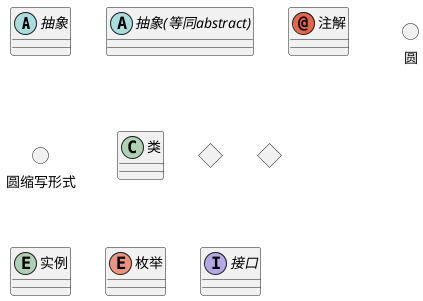

## 类之间的关系
类之间的关系是用以下符号定义的。

|**类型**|**符号**|**绘图**|
|:---|:---|:--|
|扩展|<code>&#60;&#124;&#45;&#45;</code>||
|组成|`*--`||
|聚合|`o--`||

可以用`..` 来代替`--` ，这样就可以有一条虚线 。

知道了这些规则，就可以画出以下图画：
```
@startuml
Class01 <|-- Class02
Class03 *-- Class04
Class05 o-- Class06
Class07 .. Class08
Class09 -- Class10
@enduml
```

显示效果
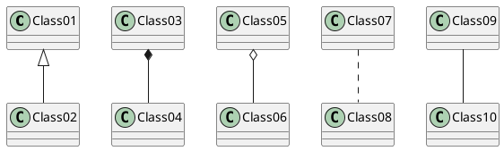

```
@startuml
Class11 <|.. Class12
Class13 --> Class14
Class15 ..> Class16
Class17 ..|> Class18
Class19 <--* Class20
@enduml
```

显示效果

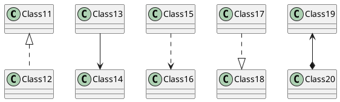

```
@startuml
Class21 #-- Class22
Class23 x-- Class24
Class25 }-- Class26
Class27 +-- Class28
Class29 ^-- Class30
@enduml
```

显示效果：

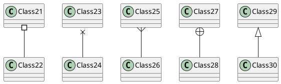

```
@startuml
Class21 #-- Class22
Class23 x-- Class24
Class25 }-- Class26
Class27 +-- Class28
Class29 ^-- Class30
@enduml
```

显示效果：


<!-- more -->

## 关系上的标签
在关系之间使用标签来说明时, 使用 `:`后接 标签文字。
对元素的说明，你可以在每一边使用 `""` 来说明.

```
@startuml
类01 "1" *-- "many" 类02 : 包含
类03 o-- 类04 : 聚合
类05 --> "1" 类06
@enduml
```

显示效果：
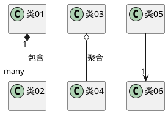

在标签的开始或结束位置添加`<` 或 `>`以表明是哪个对象作用到哪个对象上。

```
@startuml
class 汽车
发动机 - 汽车 : 驱动 >
汽车 *- 轮子 : 拥有 4 >
汽车 -- 人 : < 所属
@enduml
```

显示效果：
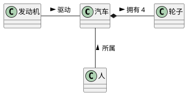

## 添加方法
要声明字段和方法，你可以使用符号 `:` 后面跟着字段或方法的名称。

系统会检查**括号**来选择方法和字段。

```
@startuml
Object <|-- ArrayList
Object : equals()
ArrayList : Object[] elementData
ArrayList : size()
@enduml
```

显示效果：
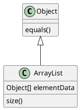

也可以在大括号之间分组 `{}` 所有字段和方法。
注意，语法对类型/名称的顺序有很大的灵活性。

```
@startuml
class Dummy {
  String data
  void methods()
}
class Flight {
   flightNumber : Integer
   departureTime : Date
}
@enduml
```

显示效果：
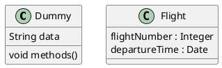

你可以使用 和 修改器来覆盖解析器关于字段和方法的默认行为。`{field}` `{method}`
```
@startuml
class Dummy {
  {field} A field (despite parentheses)
  {method} Some method
}
@enduml
```

显示效果
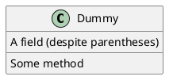
## 定义可访问性
一旦你定义了域或者方法，你可以定义 相应条目的可访问性质。

|**Character**|**Icon for field**|**Icon for method**|**Visibility**|
|---|---|---|---|
|`-`|||private|
|`#`|||protected|
|`~`|||package private|
|`+`|||public|

```
@startuml
class Dummy {
 -field1
 #field2
 ~method1()
 +method2()
}
@enduml
```

显示效果：
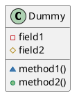

你可以采用以下命令停用这些特性 `skinparam classAttributeIconSize 0` ：
```
@startuml
skinparam classAttributeIconSize 0
class Dummy {
 -field1
 #field2
 ~method1()
 +method2()
}
@enduml
```

显示效果：
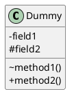

## 抽象与静态
通过修饰符`{static}`或者`{abstract}`，可以定义静态或者抽象的方法或者属性。

这些修饰符可以写在行的开始或者结束。也可以使用`{classifier}`这个修饰符来代替`{static}`.	
```
@startuml
class Dummy {
  {static} String id
  {abstract} void methods()
}
@enduml
```

显示效果：
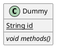

## 高级类体
PlantUML默认自动将方法和属性重新分组，你可以自己定义分隔符来重排方法和属性，下面的分隔符都是可用的：`--` `..` `==` `__`.
```
@startuml
class Foo1 {
  You can use
  several lines
  ..
  as you want
  and group
  ==
  things together.
  __
  You can have as many groups
  as you want
  --
  End of class
}
class User {
  .. Simple Getter ..
  + getName()
  + getAddress()
  .. Some setter ..
  + setName()
  __ private data __
  int age
  -- encrypted --
  String password
}
@enduml
```

显示效果：
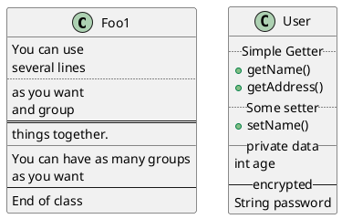

## 备注和模板
还可以在分隔符中添加标题：
模板通过类关键字("`<<`"和"`>>`")来定义
你可以使用`note left of` , `note right of` , `note top of` , `note bottom of`这些关键字来添加备注。
你还可以在类的声明末尾使用`note left`, `note right`,`note top`, `note bottom`来添加备注。
此外，单独用`note`这个关键字也是可以的，使用 `..` 符号可以作出一条连接它与其它对象的虚线。

```
@startuml
class Object << general >>
Object <|--- ArrayList
note top of Object : In java, every class\nextends this one.
note "This is a floating note" as N1
note "This note is connected\nto several objects." as N2
Object .. N2
N2 .. ArrayList
class Foo
note left: On last defined class
@enduml
```

显示效果：
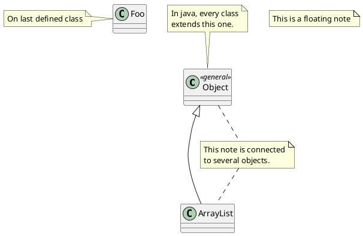
## 更多注释
可以在注释中使用部分html标签：
- `<b>`
- `<u>`
- `<i>`
- `<s>`, `<del>`, `<strike>`
- `<font color="#AAAAAA">` or `<font color="colorName">`
- `<color:#AAAAAA>` or `<color:colorName>`
- `<size:nn>` to change font size
- `` or ``: the file must be accessible by the filesystem

你也可以在注释中展示多行。

你也可以在定义的class之后直接使用 `note left`, `note right`, `note top`, `note bottom` 来定义注释。

```
@startuml
class Foo
note left: On last defined class
note top of Object
  In java, <size:18>every</size> <u>class</u>
  <b>extends</b>
  <i>this</i> one.
end note
note as N1
  This note is <u>also</u>
  <b><color:royalBlue>on several</color>
  <s>words</s> lines
  And this is hosted by 
end note
@enduml
```

显示效果：
```plantuml
@startuml
class Foo
note left: On last defined class
note top of Object
  In java, <size:18>every</size> <u>class</u>
  <b>extends</b>
  <i>this</i> one.
end note
note as N1
  This note is <u>also</u>
  <b><color:royalBlue>on several</color>
  <s>words</s> lines
  And this is hosted by 
end note
@enduml
```
## 注释属性 (field, attribute, member) 或方法

可以在字段（field、attribute、member）或方法上添加注释。 这不能与命名空间分隔符(namespaceSeparator) `::` 一起使用

### 注释属性或方法
```
@startuml
class A {
{static} int counter
+void {abstract} start(int timeout)
}
note left of A::counter
  该成员已注释
end note
note right of A::start
  在 UML 注释了此方法
end note
@enduml
```
显示效果：
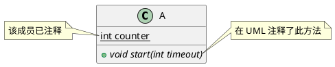
### 给同名方法注释
```
@startuml
class A {
{static} int counter
+void {abstract} start(int timeoutms)
+void {abstract} start(Duration timeout)
}
note left of A::counter
  该成员已注释
end note
note right of A::"start(int timeoutms)"
  这个start方法的参数是int类型
end note
note right of A::"start(Duration timeout)"
  这个start方法的参数是Duration类型
end note
@enduml
```
显示效果
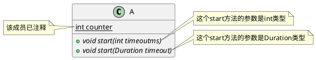
## 链接的注释

在定义链接之后，你可以用 `note on link` 给链接添加注释

如果想要改变注释相对于标签的位置，你也可以用 `note left on link`， `note right on link`， `note bottom on link`。（对应位置分别在label的左边，右边，下边）

```
@startuml
class Dummy
Dummy --> Foo : A link
note on link #red: note that is red
Dummy --> Foo2 : Another link
note right on link #blue
this is my note on right link
and in blue
end note
@enduml
```
显示效果：
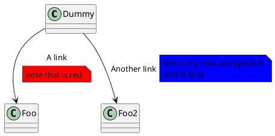
## 抽象类和接口
用关键字`abstract`或`abstract class`来定义抽象类。
抽象类用斜体显示。
也可以使用`interface`, `annotation` 和 `enum` 等关键字。

```
@startuml

abstract class AbstractList
abstract AbstractCollection
interface List
interface Collection

List <|-- AbstractList
Collection <|-- AbstractCollection

Collection <|- List
AbstractCollection <|- AbstractList
AbstractList <|-- ArrayList

class ArrayList {
  Object[] elementData
  size()
}

enum TimeUnit {
  DAYS
  HOURS
  MINUTES
}

annotation SuppressWarnings

@enduml
```
显示效果：
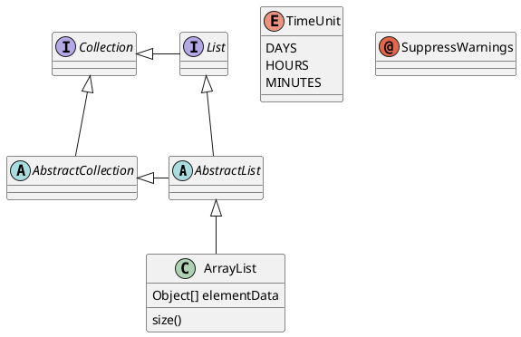
## 使用非字母字符
如果你想在类（或者枚举）的显示中使用[非字母符号](https://plantuml.com/zh/unicode)，你可以：

- 在类的定义中使用 `as` 关键字
- 在类名旁边加上 `""`

```
@startuml
class "This is my class" as class1
class class2 as "It works this way too"

class2 *-- "foo/dummy" : use
@enduml
```
显示效果
```plantuml
@startuml
class "This is my class" as class1
class class2 as "It works this way too"

class2 *-- "foo/dummy" : use
@enduml
```
## 隐藏属性、函数等
通过使用命令“`hide/show`”，你可以用参数表示类的显示方式。
基础命令是: `hide empty members`. 这个命令会隐藏空白的方法和属性。
除 `empty members` 外，你可以用:
- `empty fields` 或者 `empty attributes` 空属性,
- `empty methods` 空函数，
- `fields` 或 `attributes` 隐藏字段或属性，即使是被定义了
- `methods` 隐藏方法，即使是被定义了
- `members` 隐藏字段 和 方法，即使是被定义了
- `circle` 类名前带圈的，
- `stereotype` 原型。

同样可以使用 `hide` 或 `show` 关键词，对以下内容进行设置：

- `class` 所有类，
- `interface` 所有接口，
- `enum` 所有枚举，
- `<<foo1>>` 实现 *foo1* 的类，
- 一个既定的类名。

你可以使用 `show/hide` 命令来定义相关规则和例外。
```
@startuml

class Dummy1 {
  +myMethods()
}

class Dummy2 {
  +hiddenMethod()
}

class Dummy3 <<Serializable>> {
String name
}

hide members
hide <<Serializable>> circle
show Dummy1 methods
show <<Serializable>> fields

@enduml
```
显示效果：
```plantuml
@startuml

class Dummy1 {
  +myMethods()
}

class Dummy2 {
  +hiddenMethod()
}

class Dummy3 <<Serializable>> {
String name
}

hide members
hide <<Serializable>> circle
show Dummy1 methods
show <<Serializable>> fields

@enduml
```

## 隐藏类
你也可以使用 `show/hide` 命令来隐藏类
如果你定义了一个大的[!included](https://plantuml.com/zh/preprocessing) 文件，且想在文件包含之后隐藏部分类，该功能会很有帮助。

```
@startuml
class Foo1
class Foo2
Foo2 *-- Foo1
hide Foo2
@enduml
```
显示效果：
```plantuml
@startuml
class Foo1
class Foo2
Foo2 *-- Foo1
hide Foo2
@enduml
```

## 删除类
您还可以使用`remove`命令来删除类。

如果您定义了一个大的 [!included file]（预处理）， 并且如果您想在 [file contains]（预处理）之后删除一些类，这可能很有用。
```
@startuml

class Foo1
class Foo2

Foo2 *-- Foo1

remove Foo2

@enduml
```
显示效果：
```plantuml
@startuml

class Foo1
class Foo2

Foo2 *-- Foo1

remove Foo2

@enduml
```
## 隐藏或删除未关联的类
默认情况下, 所有的类都将会展示:
```
@startuml
class C1
class C2
class C3
C1 -- C2
@enduml
```
显示效果：
```plantuml
@startuml
class C1
class C2
class C3
C1 -- C2
@enduml
```

不过你可以使用:
- `hide @unlinked` 来隐藏未关联的类:

```
@startuml
class C1
class C2
class C3
C1 -- C2

hide @unlinked
@enduml
```
显示效果
```plantuml
@startuml
class C1
class C2
class C3
C1 -- C2

hide @unlinked
@enduml
```
- 或者使用 `remove @unlinked` 来删除未关联的类:

```
@startuml
class C1
class C2
class C3
C1 -- C2

remove @unlinked
@enduml
```
显示效果
```plantuml
@startuml
class C1
class C2
class C3
C1 -- C2

remove @unlinked
@enduml
```
## 泛型（generics）
你可以用 `<` 和 `>` 来定义类的泛型。

```
@startuml

class Foo<? extends Element> {
  int size()
}
Foo *- Element

@enduml
```
显示效果：
```plantuml
@startuml

class Foo<? extends Element> {
  int size()
}
Foo *- Element
@enduml
```
It is possible to disable this drawing using `skinparam genericDisplay old` command.
```
@startuml
skinparam genericDisplay old
class Foo<? extends Element> {
  int size()
}
Foo *- Element
@enduml
```
显示效果：
```plantuml
@startuml
skinparam genericDisplay old
class Foo<? extends Element> {
  int size()
}
Foo *- Element
@enduml
```
## 指定标记（Spot）
通常标记字符 (C, I, E or A) 用于标记 类(classes), 接口（interface）, 枚举（enum）和 抽象类（abstract classes）.
但是当你想定义原型时，可以增加对应的单个字符及颜色，来定义自己的标记（spot），就像下面一样：
```
@startuml

class System << (S,#FF7700) Singleton >>
class Date << (D,orchid) >>
@enduml
```
显示效果：
```plantuml
@startuml
class System << (S,#FF7700) Singleton >>
class Date << (D,orchid) >>
@enduml
```
## 包
你可以通过关键词 `package` 声明包，同时可选的来声明对应的背景色（通过使用html色彩代码或名称）。
注意：包可以被定义为嵌套。

```
@startuml
package "Classic Collections" #DDDDDD {
  Object <|-- ArrayList
}
package net.sourceforge.plantuml {
  Object <|-- Demo1
  Demo1 *- Demo2
}
@enduml
```
显示效果：
```
@startuml
package "Classic Collections" #DDDDDD {
  Object <|-- ArrayList
}
package net.sourceforge.plantuml {
  Object <|-- Demo1
  Demo1 *- Demo2
}
@enduml
```
## 包样式
包可以定义不同的样式。
你可以通过以下的命令来设置默认样式 : `skinparam packageStyle`,或者对包使用对应的模板:
```
@startuml
scale 750 width
package foo1 <<Node>> {
  class Class1
}

package foo2 <<Rectangle>> {
  class Class2
}

package foo3 <<Folder>> {
  class Class3
}

package foo4 <<Frame>> {
  class Class4
}

package foo5 <<Cloud>> {
  class Class5
}

package foo6 <<Database>> {
  class Class6
}

@enduml
```
显示效果：
```
@startuml
scale 750 width
package foo1 <<Node>> {
  class Class1
}

package foo2 <<Rectangle>> {
  class Class2
}

package foo3 <<Folder>> {
  class Class3
}

package foo4 <<Frame>> {
  class Class4
}

package foo5 <<Cloud>> {
  class Class5
}

package foo6 <<Database>> {
  class Class6
}

@enduml
```
你也可以参考下面的示例来定义包之间的连线:
```
@startuml

skinparam packageStyle rectangle

package foo1.foo2 {
}

package foo1.foo2.foo3 {
  class Object
}

foo1.foo2 +-- foo1.foo2.foo3

@enduml
```
显示效果
```plantuml
@startuml

skinparam packageStyle rectangle

package foo1.foo2 {
}

package foo1.foo2.foo3 {
  class Object
}

foo1.foo2 +-- foo1.foo2.foo3

@enduml
```
## 命名空间（Namespaces）
在使用包（package）时（区别于命名空间），类名是类的唯一标识。 也就意味着，在不同的包（package）中的类，不能使用相同的类名。
在那种情况下（译注：同名、不同全限定名类），你应该使用[命名空间](https://zh.wikipedia.org/wiki/命名空间)来取而代之。
你可以从其他命名空间，使用全限定名来引用类， 默认命名空间（译注：无名的命名空间）下的类，以一个“."开头（的类名）来引用（译注：示例中的`BaseClass`).

注意：你不用显示地创建命名空间：一个使用全限定名的类会自动被放置到对应的命名空间。
```
@startuml

class BaseClass

namespace net.dummy #DDDDDD {
    .BaseClass <|-- Person
    Meeting o-- Person

    .BaseClass <|- Meeting
}

namespace net.foo {
  net.dummy.Person  <|- Person
  .BaseClass <|-- Person

  net.dummy.Meeting o-- Person
}

BaseClass <|-- net.unused.Person

@enduml
```
显示效果：
```plantuml
@startuml

class BaseClass

namespace net.dummy #DDDDDD {
    .BaseClass <|-- Person
    Meeting o-- Person

    .BaseClass <|- Meeting
}

namespace net.foo {
  net.dummy.Person  <|- Person
  .BaseClass <|-- Person

  net.dummy.Meeting o-- Person
}

BaseClass <|-- net.unused.Person

@enduml
```
## 自动创建命名空间
使用命令 `set namespaceSeparator ???` 你可以自定义命名空间分隔符（为 “.” 以外的字符）.
```
@startuml

set namespaceSeparator ::
class X1::X2::foo {
  some info
}
@enduml
```

显示效果：
```plantuml
@startuml

set namespaceSeparator ::
class X1::X2::foo {
  some info
}
@enduml
```

禁止自动创建包则可以使用 `set namespaceSeparator none`.
```
@startuml

set namespaceSeparator none
class X1.X2.foo {
  some info
}

@enduml
```
显示效果：
```plantuml
@startuml

set namespaceSeparator none
class X1.X2.foo {
  some info
}
@enduml
```
## 棒棒糖接口
需要定义棒棒糖样式的接口时可以遵循以下语法:
- `bar ()- foo`
- `bar ()-- foo`
- `foo -() bar`

```
@startuml
class foo类
bar ()- foo类
@enduml
```
显示效果：
```plantuml
@startuml
class foo类
bar ()- foo类
@enduml
```
## 改变箭头方向
类之间默认采用两个破折号 `--` 显示出垂直 方向的线. 要得到水平方向的可以像这样使用单破折号 (或者点):
```
@startuml
教室 o- 学生
教室 *-- 椅子
@enduml
```

显示效果：
```plantuml
@startuml
教室 o- 学生
教室 *-- 椅子
@enduml
```
你也可以通过改变倒置链接来改变方向

```
@startuml
学生 -o 教室
椅子 --* 教室
@enduml
```

显示效果：
```plantuml
@startuml
学生 -o 教室
椅子 --* 教室
@enduml
```
也可通过在箭头内部使用关键字， 例如`left`, `right`, `up` 或者 `down`，来改变方向

```
@startuml
foo -left-> dummyLeft
foo -right-> dummyRight
foo -up-> dummyUp
foo -down-> dummyDown
@enduml
```
显示效果：
```plantuml
@startuml
foo -left-> dummyLeft
foo -right-> dummyRight
foo -up-> dummyUp
foo -down-> dummyDown
@enduml
```

您可以使用缩写形式来表示方向，第一个字符（例如，`-d-` 而不是 `-down-`) 或前两个字符 (`-do-`)。
请注意，您不应滥用此功能：*Graphviz* 通常无需调整即可提供良好的结果。

同时也支持 [`left to right direction`](https://plantuml.com/zh/use-case-diagram#d551e48d272b2b07) 参数:

```
@startuml
left to right direction
foo -left-> dummyLeft
foo -right-> dummyRight
foo -up-> dummyUp
foo -down-> dummyDown
@enduml
```
显示效果：
```plantuml
@startuml
left to right direction
foo -left-> dummyLeft
foo -right-> dummyRight
foo -up-> dummyUp
foo -down-> dummyDown
@enduml
```
## “关系”类
你可以在定义了两个类之间的关系后定义一个 *关系类 association class* 例如:
```
@startuml
class Student {
  Name
}
Student "0..*" - "1..*" Course
(Student, Course) .. Enrollment

class Enrollment {
  drop()
  cancel()
}
@enduml
```
显示效果：
```plantuml
@startuml
class Student {
  Name
}
Student "0..*" - "1..*" Course
(Student, Course) .. Enrollment

class Enrollment {
  drop()
  cancel()
}
@enduml
```
也可以用另一种方式:
```
@startuml
class Student {
  Name
}
Student "0..*" -- "1..*" Course
(Student, Course) . Enrollment

class Enrollment {
  drop()
  cancel()
}
@enduml
```
显示效果：
```plantuml
@startuml
class Student {
  Name
}
Student "0..*" -- "1..*" Course
(Student, Course) . Enrollment

class Enrollment {
  drop()
  cancel()
}
@enduml
```
## 同级关联(Association on same classe)
```
@startuml
class 站台 {
    +名称: 字符串
}

class 通道 {
    +花费: 剩余时间
}

<> 结点

通道 . 结点
结点 - "从 0..*" 站台
结点 - "到 0..* " 站台
@enduml
```
显示效果：
```plantuml
@startuml
class 站台 {
    +名称: 字符串
}

class 通道 {
    +花费: 剩余时间
}

<> 结点

通道 . 结点
结点 - "从 0..*" 站台
结点 - "到 0..* " 站台
@enduml
```
## 样式参数
用[skinparam](https://plantuml.com/zh/skinparam)改变字体和颜色。
可以在如下场景中使用：
- 在图示的定义中，
- [在引入的文件中](https://plantuml.com/zh/preprocessing)，
- 在[命令行](https://plantuml.com/zh/command-line)或者[ANT任务](https://plantuml.com/zh/ant-task)提供的配置文件中。

```
@startuml

skinparam class {
BackgroundColor PaleGreen
ArrowColor SeaGreen
BorderColor SpringGreen
}
skinparam stereotypeCBackgroundColor YellowGreen

类01 "1" *-- "many" 类02 : 包含

类03 o-- 类04 : 聚合

@enduml
```
显示效果：
```plantuml
@startuml

skinparam class {
BackgroundColor PaleGreen
ArrowColor SeaGreen
BorderColor SpringGreen
}
skinparam stereotypeCBackgroundColor YellowGreen

类01 "1" *-- "many" 类02 : 包含

类03 o-- 类04 : 聚合

@enduml
```
## 模型样式
你可以给模型自定义颜色和字体(You can define specific color and fonts for stereotyped classes.)

```
@startuml
skinparam class {
BackgroundColor PaleGreen
ArrowColor SeaGreen
BorderColor SpringGreen
BackgroundColor<<Foo>> Wheat
BorderColor<<Foo>> Tomato
}
skinparam stereotypeCBackgroundColor YellowGreen
skinparam stereotypeCBackgroundColor<< Foo >> DimGray

类1 <<Foo>>
类3 <<Foo>>
类1 "1" *-- "*" 类2 : 包含(contains)

类3 o-- 类4 : 聚合(aggregation)

@enduml
```
显示效果：
```plantuml
@startuml

skinparam class {
BackgroundColor PaleGreen
ArrowColor SeaGreen
BorderColor SpringGreen
BackgroundColor<<Foo>> Wheat
BorderColor<<Foo>> Tomato
}
skinparam stereotypeCBackgroundColor YellowGreen
skinparam stereotypeCBackgroundColor<< Foo >> DimGray

类1 <<Foo>>
类3 <<Foo>>
类1 "1" *-- "*" 类2 : 包含(contains)

类3 o-- 类4 : 聚合(aggregation)

@enduml
```
## 渐变颜色
你可以使用 # 号为类、注释等等自定义颜色。

在自定义颜色中你可以使用标准颜色的名称 或 RGB 编码，参见: [Colors](https://plantuml.com/zh/color).

你同样可以使用下面的语法为背景色声明为渐变的颜色:

渐变的两个颜色可以使用下面的符号分割：

- `|`,
- `/`,
- `\`,
- `-`,

他们的区别在于颜色渐变的方向不同。

例如:
```
@startuml

skinparam backgroundcolor AntiqueWhite/Gold
skinparam classBackgroundColor Wheat|CornflowerBlue

class 类1 #red-green
note left of 类1 #blue\9932CC
  这是foo类的
  渐变颜色
end note

package 包1 #GreenYellow/LightGoldenRodYellow {
  class 类2
}

@enduml
```
显示效果：
```plantuml
@startuml

skinparam backgroundcolor AntiqueWhite/Gold
skinparam classBackgroundColor Wheat|CornflowerBlue

class 类1 #red-green
note left of 类1 #blue\9932CC
  这是foo类的
  渐变颜色
end note

package 包1 #GreenYellow/LightGoldenRodYellow {
  class 类2
}
@enduml
```
## 辅助布局
有时候，默认布局并不完美...
你可以使用 `together` 关键词将某些类进行分组： 布局引擎会尝试将它们捆绑在一起（如同在一个包(package)内)
你也可以使用建立 `hidden` 链接的方式来强制布局

```
@startuml

class Bar1
class Bar2
together {
  class Together1
  class Together2
  class Together3
}
Together1 - Together2
Together2 - Together3
Together2 -[hidden]--> Bar1
Bar1 -[hidden]> Bar2

@enduml
```
显示效果：
```plantuml
@startuml

class Bar1
class Bar2
together {
  class Together1
  class Together2
  class Together3
}
Together1 - Together2
Together2 - Together3
Together2 -[hidden]--> Bar1
Bar1 -[hidden]> Bar2

@enduml
```
## 拆分大文件
有些情况下，会有一些很大的图片文件。
可以用 `page (hpages)x(vpages)` 这个命令把生成的图片文件拆分成若干个文件。
`hpages` 用来表示水平方向页面数， and `vpages` 用来表示垂直方面页面数。
你也可以使用特定的皮肤设定来给分页添加边框（见例子）

```
@startuml
' Split into 4 pages
page 2x2
skinparam pageMargin 10
skinparam pageExternalColor gray
skinparam pageBorderColor black

class BaseClass

namespace net.dummy #DDDDDD {
    .BaseClass <|-- Person
    Meeting o-- Person

    .BaseClass <|- Meeting

}

namespace net.foo {
  net.dummy.Person  <|- Person
  .BaseClass <|-- Person

  net.dummy.Meeting o-- Person
}

BaseClass <|-- net.unused.Person
@enduml
```
显示效果：
```plantuml
@startuml
' Split into 4 pages
page 2x2
skinparam pageMargin 10
skinparam pageExternalColor gray
skinparam pageBorderColor black

class BaseClass

namespace net.dummy #DDDDDD {
    .BaseClass <|-- Person
    Meeting o-- Person

    .BaseClass <|- Meeting

}

namespace net.foo {
  net.dummy.Person  <|- Person
  .BaseClass <|-- Person

  net.dummy.Meeting o-- Person
}

BaseClass <|-- net.unused.Person
@enduml
```
## 扩展(Extends) 和 实现(implements)
他们同样使用 `extends` 和 `implements` 关键词.

```
@startuml
class ArrayList implements List
class ArrayList extends AbstractList
@enduml
```
显示效果：
```plantuml
@startuml
class ArrayList implements List
class ArrayList extends AbstractList
@enduml
```
## 方括号表示关系(连接或箭头)的样式
### 线样式
可以明确的使用 `bold`, `dashed`, `dotted`, `hidden` 或 `plain` 来表示关系, 连接或箭头:
- 没有标签

```
@startuml
title 使用方括号([])表示的线样式（无标签版）

class foo类
class bar类
bar类1 : [bold]  
bar类2 : [dashed]
bar类3 : [dotted]
bar类4 : [hidden]
bar类5 : [plain] 

foo类 --> bar类
foo类 -[bold]-> bar类1
foo类 -[dashed]-> bar类2
foo类 -[dotted]-> bar类3
foo类 -[hidden]-> bar类4
foo类 -[plain]-> bar类5
@enduml
```
显示效果：
```plantuml
@startuml
title 使用方括号([])表示的线样式（无标签版）

class foo类
class bar类
bar类1 : [bold]  
bar类2 : [dashed]
bar类3 : [dotted]
bar类4 : [hidden]
bar类5 : [plain] 

foo类 --> bar类
foo类 -[bold]-> bar类1
foo类 -[dashed]-> bar类2
foo类 -[dotted]-> bar类3
foo类 -[hidden]-> bar类4
foo类 -[plain]-> bar类5
@enduml
```
- 有标签
```
@startuml
title 使用方括号([])表示的线样式（有标签版）

class foo类
class bar类
bar类1 : [bold]  
bar类2 : [dashed]
bar类3 : [dotted]
bar类4 : [hidden]
bar类5 : [plain] 

foo类 --> bar类          : ∅
foo类 -[bold]-> bar类1   : [bold]
foo类 -[dashed]-> bar类2 : [dashed]
foo类 -[dotted]-> bar类3 : [dotted]
foo类 -[hidden]-> bar类4 : [hidden]
foo类 -[plain]-> bar类5  : [plain]
@enduml
```

显示效果：
```plantuml
@startuml
title 使用方括号([])表示的线样式（有标签版）

class foo类
class bar类
bar类1 : [bold]  
bar类2 : [dashed]
bar类3 : [dotted]
bar类4 : [hidden]
bar类5 : [plain] 

foo类 --> bar类          : ∅
foo类 -[bold]-> bar类1   : [bold]
foo类 -[dashed]-> bar类2 : [dashed]
foo类 -[dotted]-> bar类3 : [dotted]
foo类 -[hidden]-> bar类4 : [hidden]
foo类 -[plain]-> bar类5  : [plain]
@enduml
```
### 线颜色
```
@startuml
title 使用方括号([])表示的线颜色
class foo类
class bar类
bar类1 : [#red]
bar类2 : [#green]
bar类3 : [#blue]

foo类 --> bar类
foo类 -[#red]-> bar类1     : [#red]
foo类 -[#green]-> bar类2   : [#green]
foo类 -[#blue]-> bar类3    : [#blue]
'foo类 -[#blue;#yellow;#green]-> bar类4
@enduml
```
显示效果：
```plantuml
@startuml
title 使用方括号([])表示的线颜色
class foo类
class bar类
bar类1 : [#red]
bar类2 : [#green]
bar类3 : [#blue]

foo类 --> bar类
foo类 -[#red]-> bar类1     : [#red]
foo类 -[#green]-> bar类2   : [#green]
foo类 -[#blue]-> bar类3    : [#blue]
'foo类 -[#blue;#yellow;#green]-> bar类4
@enduml
```
### 线宽度
```
@startuml
title 使用方括号([])表示的线宽度
class foo类
class bar类
bar类1 : [thickness=1]
bar类2 : [thickness=2]
bar类3 : [thickness=4]
bar类4 : [thickness=8]
bar类5 : [thickness=16]

foo类 --> bar类                 : ∅
foo类 -[thickness=1]-> bar类1   : [1]
foo类 -[thickness=2]-> bar类2   : [2]
foo类 -[thickness=4]-> bar类3   : [4]
foo类 -[thickness=8]-> bar类4   : [8]
foo类 -[thickness=16]-> bar类5  : [16]

@enduml
```
显示效果：
```plantuml
@startuml
title 使用方括号([])表示的线宽度
class foo类
class bar类
bar类1 : [thickness=1]
bar类2 : [thickness=2]
bar类3 : [thickness=4]
bar类4 : [thickness=8]
bar类5 : [thickness=16]

foo类 --> bar类                 : ∅
foo类 -[thickness=1]-> bar类1   : [1]
foo类 -[thickness=2]-> bar类2   : [2]
foo类 -[thickness=4]-> bar类3   : [4]
foo类 -[thickness=8]-> bar类4   : [8]
foo类 -[thickness=16]-> bar类5  : [16]

@enduml
```

### 混合样式
```
@startuml
title 使用方括号([])表示的线混合样式
class foo类
class bar类
bar类1 : [#red,thickness=1]
bar类2 : [#red,dashed,thickness=2]
bar类3 : [#green,dashed,thickness=4]
bar类4 : [#blue,dotted,thickness=8]
bar类5 : [#blue,plain,thickness=16]

foo类 --> bar类                             : ∅
foo类 -[#red,thickness=1]-> bar类1          : [#red,1]
foo类 -[#red,dashed,thickness=2]-> bar类2   : [#red,dashed,2]
foo类 -[#green,dashed,thickness=4]-> bar类3 : [#green,dashed,4]
foo类 -[#blue,dotted,thickness=8]-> bar类4  : [blue,dotted,8]
foo类 -[#blue,plain,thickness=16]-> bar类5  : [blue,plain,16]
@enduml
```
显示效果：
```plantuml
@startuml
title 使用方括号([])表示的线混合样式
class foo类
class bar类
bar类1 : [#red,thickness=1]
bar类2 : [#red,dashed,thickness=2]
bar类3 : [#green,dashed,thickness=4]
bar类4 : [#blue,dotted,thickness=8]
bar类5 : [#blue,plain,thickness=16]

foo类 --> bar类                             : ∅
foo类 -[#red,thickness=1]-> bar类1          : [#red,1]
foo类 -[#red,dashed,thickness=2]-> bar类2   : [#red,dashed,2]
foo类 -[#green,dashed,thickness=4]-> bar类3 : [#green,dashed,4]
foo类 -[#blue,dotted,thickness=8]-> bar类4  : [blue,dotted,8]
foo类 -[#blue,plain,thickness=16]-> bar类5  : [blue,plain,16]
@enduml
```
## 改变关系(线和箭头)的颜色和样式(单行样式)
你可以改变表示关系的线和箭头的[颜色](https://plantuml.com/zh/color)或样式，使用下面的单行样式格式：
- `#color;line.[bold|dashed|dotted];text:color`

```
@startuml
class foo类
foo类 --> bar类 : 默认
foo类 --> bar类1 #line:red;line.bold;text:red  : 红色粗线
foo类 --> bar类2 #green;line.dashed;text:green : 绿色断线
foo类 --> bar类3 #blue;line.dotted;text:blue   : 蓝色点线
@enduml
```

显示效果：
```plantuml
@startuml
class foo类
foo类 --> bar类 : 默认
foo类 --> bar类1 #line:red;line.bold;text:red  : 红色粗线
foo类 --> bar类2 #green;line.dashed;text:green : 绿色断线
foo类 --> bar类3 #blue;line.dotted;text:blue   : 蓝色点线
@enduml
```
## 改变类颜色和样式 (单行样式)

你可以改变定义类的 [颜色](https://plantuml.com/zh/color) 或样式， 通过下面两种指定格式:
- `#color ##[style]color`
  - 第一个颜色(`#color`)表示背景色，然后第二个表示线的样式和颜色(`##[style]color`)
```
@startuml
abstract   抽象类
annotation 注解     #pink ##[bold]red
class      类      #palegreen ##[dashed]green
interface  接口    #aliceblue ##[dotted]blue
@enduml
```

显示效果：
```plantuml
@startuml
abstract   抽象类
annotation 注解     #pink ##[bold]red
class      类      #palegreen ##[dashed]green
interface  接口    #aliceblue ##[dotted]blue
@enduml
```

- `#[color|back:color];header:color;line:color;line.[bold|dashed|dotted];text:color`
```
@startuml
abstract   抽象类
annotation 注解     #pink;line:red;line.bold;text:red
class      类      #palegreen;line:green;line.dashed;text:green
interface  接口    #aliceblue;line:blue;line.dotted;text:blue
@enduml
```

显示效果：
```plantuml
@startuml
abstract   抽象类
annotation 注解     #pink;line:red;line.bold;text:red
class      类      #palegreen;line:green;line.dashed;text:green
interface  接口    #aliceblue;line:blue;line.dotted;text:blue
@enduml
```
第一个原始示例:
```
@startuml
class bar类 #line:green;back:lightblue
class bar类2 #lightblue;line:green

class Foo类1 #back:red;line:00FFFF
class Foo类Dashed #line.dashed:blue
class Foo类Dotted #line.dotted:blue
class Foo类Bold #line.bold
class Demo类1 #back:lightgreen|yellow;header:blue/red
@enduml
```
显示效果：
```plantuml
@startuml
class bar类 #line:green;back:lightblue
class bar类2 #lightblue;line:green

class Foo类1 #back:red;line:00FFFF
class Foo类Dashed #line.dashed:blue
class Foo类Dotted #line.dotted:blue
class Foo类Bold #line.bold
class Demo类1 #back:lightgreen|yellow;header:blue/red
@enduml
```
## 类成员的箭头方向(Arrows from/to class members)
```
@startuml
class Foo类 {
+ 字段1
+ 字段2
}

class Bar类 {
+ 字段3
+ 字段4
}

Foo类::字段1 --> Bar类::字段3 : foo
Foo类::字段2 --> Bar类::字段4 : bar
@enduml
```
显示效果：
```plantuml
@startuml
class Foo类 {
+ 字段1
+ 字段2
}

class Bar类 {
+ 字段3
+ 字段4
}

Foo类::字段1 --> Bar类::字段3 : foo
Foo类::字段2 --> Bar类::字段4 : bar
@enduml
```

```
@startuml
left to right direction

class User类 {
  id : INTEGER
  ..
  其他id : INTEGER
}

class Email类 {
  id : INTEGER
  ..
  用户_id : INTEGER
  地址 : STRING
}

User类::id *-- Email类::用户_id
@enduml
```
显示效果：
```plantuml
@startuml
left to right direction

class User类 {
  id : INTEGER
  ..
  其他id : INTEGER
}

class Email类 {
  id : INTEGER
  ..
  用户_id : INTEGER
  地址 : STRING
}

User类::id *-- Email类::用户_id
@enduml
```
## 分组继承关系(Grouping inheritance arrow heads)
你可以合并所有的箭头，使用 `skinparam groupInheritance`, 用阈值(第几组)作为参数。

### 阈值 1 (没有分组)
```
@startuml
skinparam groupInheritance 1

A1 <|-- B1

A2 <|-- B2
A2 <|-- C2

A3 <|-- B3
A3 <|-- C3
A3 <|-- D3

A4 <|-- B4
A4 <|-- C4
A4 <|-- D4
A4 <|-- E4
@enduml
```
显示效果
```plantuml
@startuml
skinparam groupInheritance 1
A1 <|-- B1

A2 <|-- B2
A2 <|-- C2

A3 <|-- B3
A3 <|-- C3
A3 <|-- D3

A4 <|-- B4
A4 <|-- C4
A4 <|-- D4
A4 <|-- E4
@enduml
```

### 阈值 2 (从第2组开始分组)

```
@startuml
skinparam groupInheritance 2

A1 <|-- B1

A2 <|-- B2
A2 <|-- C2

A3 <|-- B3
A3 <|-- C3
A3 <|-- D3

A4 <|-- B4
A4 <|-- C4
A4 <|-- D4
A4 <|-- E4
@enduml
```
显示效果：
```plantuml
@startuml
skinparam groupInheritance 2
A1 <|-- B1

A2 <|-- B2
A2 <|-- C2

A3 <|-- B3
A3 <|-- C3
A3 <|-- D3

A4 <|-- B4
A4 <|-- C4
A4 <|-- D4
A4 <|-- E4
@enduml
```

### 阈值 3 (从第3组开始分组)
```
@startuml
skinparam groupInheritance 3
A1 <|-- B1

A2 <|-- B2
A2 <|-- C2

A3 <|-- B3
A3 <|-- C3
A3 <|-- D3

A4 <|-- B4
A4 <|-- C4
A4 <|-- D4
A4 <|-- E4
@enduml
```
显示效果：
```plantuml
@startuml
skinparam groupInheritance 3
A1 <|-- B1

A2 <|-- B2
A2 <|-- C2

A3 <|-- B3
A3 <|-- C3
A3 <|-- D3

A4 <|-- B4
A4 <|-- C4
A4 <|-- D4
A4 <|-- E4
@enduml
```
## 阈值 4 (从第4组开始分组)
```
@startuml
skinparam groupInheritance 4

A1 <|-- B1

A2 <|-- B2
A2 <|-- C2

A3 <|-- B3
A3 <|-- C3
A3 <|-- D3

A4 <|-- B4
A4 <|-- C4
A4 <|-- D4
A4 <|-- E4
@enduml
```
显示效果：
```plantuml
@startuml
skinparam groupInheritance 4

A1 <|-- B1

A2 <|-- B2
A2 <|-- C2

A3 <|-- B3
A3 <|-- C3
A3 <|-- D3

A4 <|-- B4
A4 <|-- C4
A4 <|-- D4
A4 <|-- E4
@enduml
```

# 参考资料

https://plantuml.com/zh/class-diagram
http://pdf.plantuml.net/PlantUML_Language_Reference_Guide_zh.pdf
