# 倒置链表
- 创建一个新的链表
- 遍历原来的链表，找到最后一个节点(`最后.next==null`)，
- 然后断开最后一个节点与原来的链表的连接(`倒数第二.next==null`)，
- 接着把最后一个节点，放到新链表的尾部。

# java代码
```java
/**
 * 颠倒链表，使得链表的尾部变成头部
 * 
 * @param head 链表头节点的引用
 * @return 颠倒后的链表的头节点的地址
 */
public static Node invertLink(Node head) {
	// 颠倒后的新链表的头节点
	Node newHead = null;
	// 颠倒后的新链表的尾节点
	Node newTail = null;
	// 倒数第二个节点
	Node secondToLast = null;
	// 最后一个节点
	Node last = null;
	// 如果头节点后面还有节点的话
	while (head.next != null) {
		// 查找倒数第2的节点
		secondToLast = findSecondToLastNode(head);
		// System.out.print("倒数第2=" + secondToLast.data);
		// 倒数第1个节点
		last = secondToLast.next;
		// System.out.println(",倒数第1=" + last.data);
		// 断开最后一个节点
		secondToLast.next = null;

		if (newHead == null) {
			// 第一次断开的尾节点,作为新链表的头节点。
			newHead = last;
			newTail = last;
		} else {
			// 旧链表的尾节点作为新链表的尾节点
			newTail.next = last;
			// 新加入的节点作为尾节点
			newTail = newTail.next;
		}
	}
	last=null;
	secondToLast=null;
	// 处理旧链表的最后一个节点，也就是头节点
	// 头节点作为最后的尾节点
	newTail.next = head;
	// 新加入的节点作为尾节点
	newTail = newTail.next;
	// 原来的头指针断开与头节点的连接
	head = null;
	// 返回新链表的头节点
	return newHead;
}

/**
 * 查找倒数第2的节点
 * 
 * @param head 链表的头节点的引用
 * @return 链表倒数第二节点的引用
 */
private static Node findSecondToLastNode(Node head) {
    Node p = head;
    while (p.next.next != null) {
        p = p.next;
    }
    return p;
}
```

# 链表倒置代码执行示意图

原来的链表

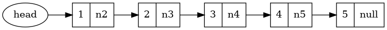

创建新链表的头指针和尾指针

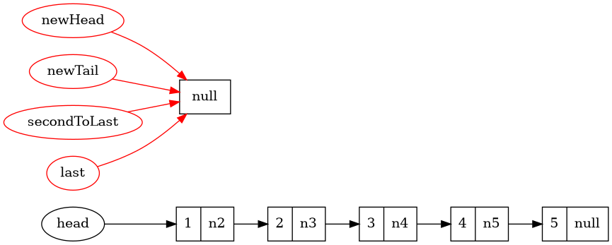
在旧链表中查找倒数第二个节点，并通过倒数第2个节点得到倒数第1个节点

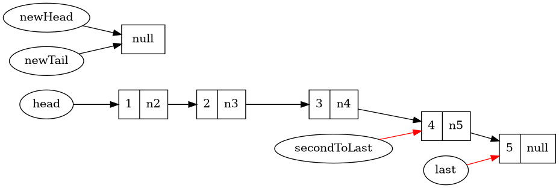

断开原来链表中尾节点

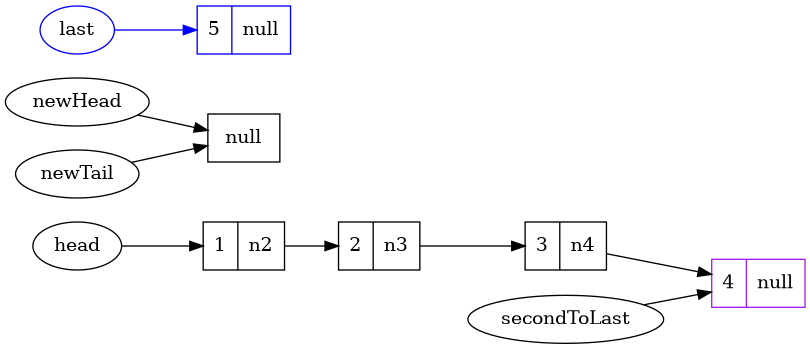

原来链表中的尾节点作为新链表的头节点以及尾节点

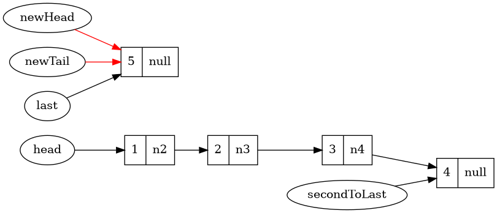

再次查找出旧链表的倒数第二个节点

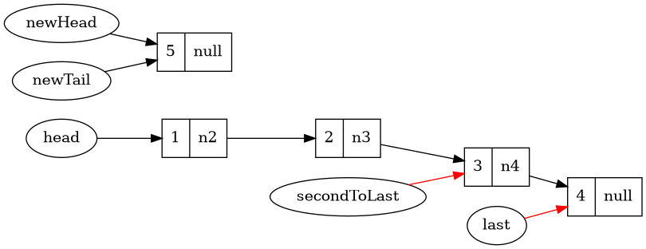

断开旧链表的最后一个节点

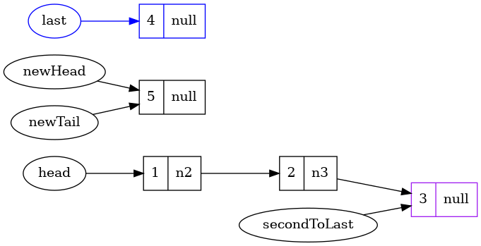

摘下的节点连接到新链表的尾部

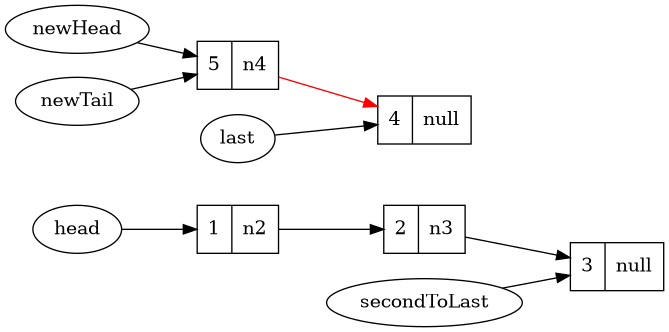

新插入的节点作为新链表的尾节点

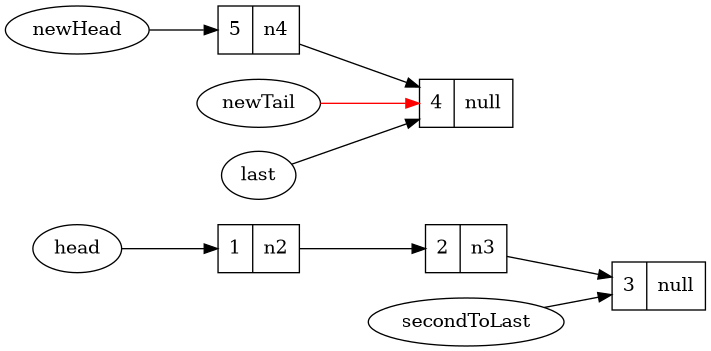

查找旧链表中倒数第二个节点

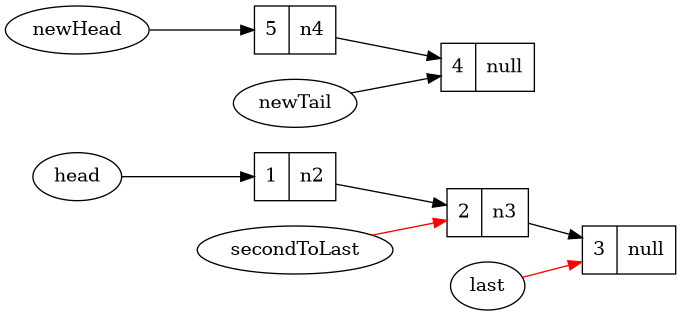

10：摘下最后一个节点

```plantuml
@startdot
digraph link10{
  rankdir=LR;
  node [shape=record];
  head [shape=ellipse];
  newHead [shape=ellipse]
  newTail [shape=ellipse]
  secondToLast [shape=ellipse]
  last [shape=ellipse] [color="blue"]
  n1 [label="{1|n2}"]
  n2 [label="{2|null}"] [color=" "]
  n3 [label="{3|null}"] [color="blue"]
  n4 [label="{4|null}"]
  n5 [label="{5|n4}"]
  newHead -> n5
  newTail -> n4
  n5 -> n4
  secondToLast -> n2
  last -> n3 [color="blue"]
  head -> n1;
  n1 -> n2;
}
@enddot
```

11：摘下的节点连接到新链表的尾部

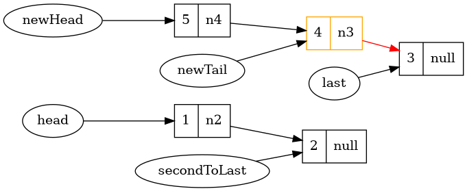

12：新节点作为尾节点

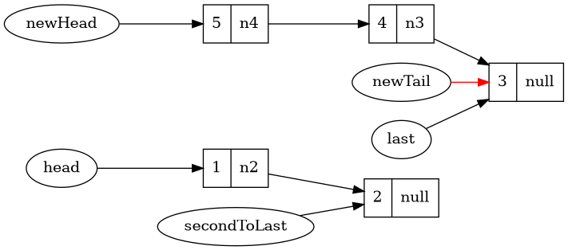

13：查找链表中倒数第2个节点

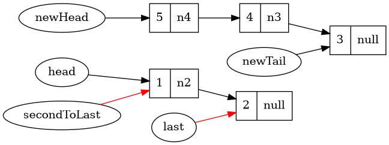

14：摘下旧链表中的最后一个节点

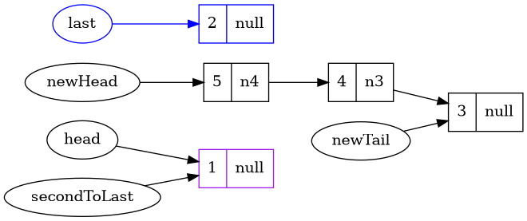

15：新节点连接到新链表的尾部

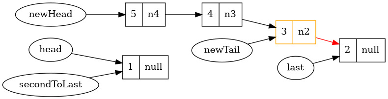

16：新节点作为新链表的尾节点

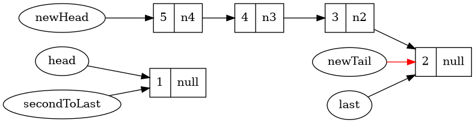

17：倒数第1，倒数第2指针置空

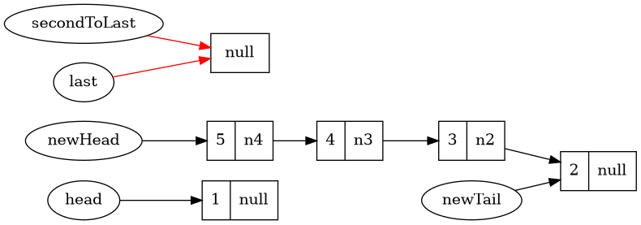

18：旧链表的头节点连接到新链表的尾部

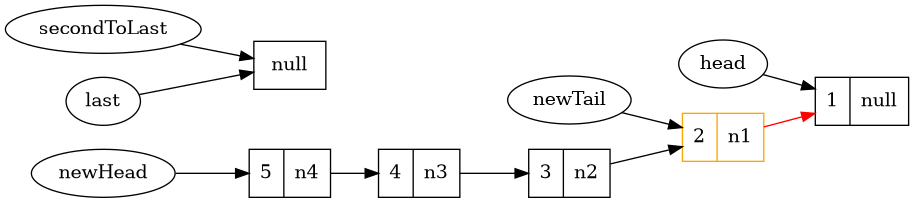

19：设置新插入的节点为尾节点，然后断开旧链表的头指针与该节点的连接。

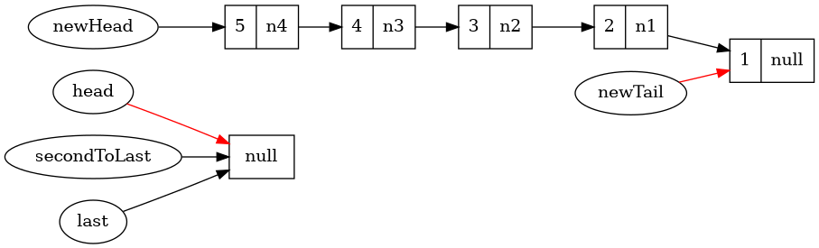

20：得到反转之后的新链表

```plantuml
@startdot
digraph link20{
  rankdir=LR;
  node [shape=record];
  // head [shape=ellipse];
  newHead [shape=ellipse]
  // newTail [shape=ellipse]
  // secondToLast [shape=ellipse]
  // last [shape=ellipse]
  n1 [label="{1|null}"]
  n2 [label="{2|n1}"]
  n3 [label="{3|n2}"]
  n4 [label="{4|n3}"]
  n5 [label="{5|n4}"]
  newHead -> n5
  // newTail -> n1 [color="red"]
  n5 -> n4
  n4 -> n3
  n3 -> n2
  n2 -> n1
  // secondToLast -> null
  // last -> null
  // head -> null [color="red"]
}
@enddot
```
