# 头插法创建链表
思想：把新创建的节点插入到头节点的前面作为新的头节点。
## 代码
### 成员变量
```java
private int data;
private Node next;
```
### 头插法代码


<!-- xxx -->
```java
/**
 * 使用头插入法创建链表。
 * 所谓头插法，就是新创建的节点插入到旧的头结点的前面，作为新的头结点。
 * 
 * @return 链表的头结点的引用(地址)
 */
public static Node createLinkByHead() {
	Node h = null;
    Node n = null;
	Scanner scanner = new Scanner(System.in);
	int input = -1;
	while ((input = scanner.nextInt()) > 0) {
		// 创建一个节点
		n = new Node(input);
		// 头节点的地址赋值给新节点
		// 新节点连接到头结点上
		n.next = h;
		// 以新节点作为新的头结点
		h = n;
	}
	return h;
}
```
### 代码执行过程示意图

方法开始执行时，先创建`Node`的引用变量`h`和`n`,此时`h`和`n`并没有引用对象。他们的值都为`null`,如下图所示：

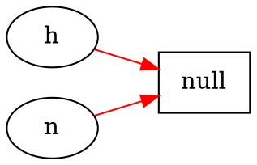

用户从键盘输入一个大于0的数字之后，这里假设输入的是`1`，
则会创建一个Node对象，并把该对象的地址赋值给引用变量`n`.
如下图所示：

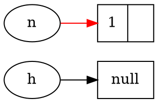

此时创建的节点是第1个节点，它后面没有旧的节点，所以该节点的地址域应该赋值为null,因为head的值也是null,所以这里设置为head的值。

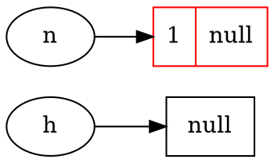

接下来把这个新创建的直接的地址赋值给头指针h:

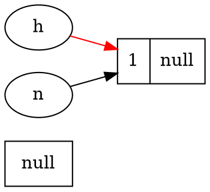

然后，再次创建一个新的节点，地址赋值给引用变量n

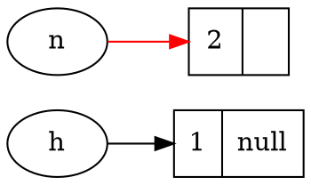

新创建的节点的地址域记录下链表的头节点的地址

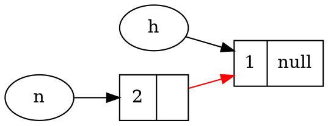

头指针记录新创建的节点的地址

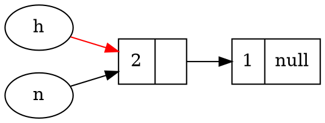

然后在次创建一个新节点，地址记录在指针n

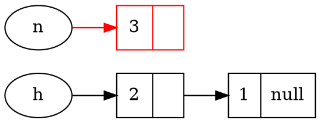

新创建的节点的地址域记录头节点的地址

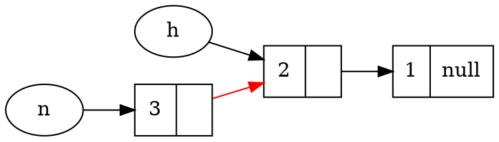

头指针记录下新创建的节点的地址

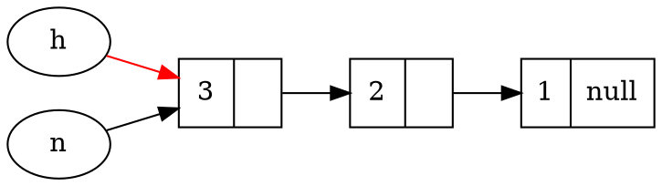

再次创建一个新的节点，地址记录在指针n中。

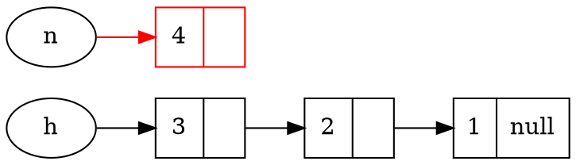

新创建的节点记录头节点的地址

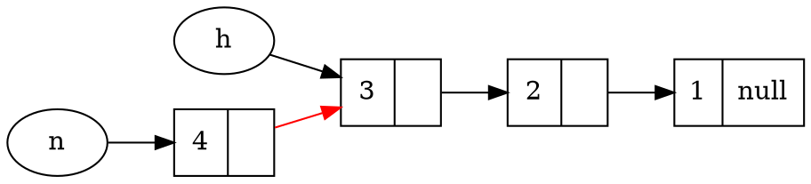
