# 尾插法创建链表示意图
Node head=null;
Node tail=null;
Node node1=null;

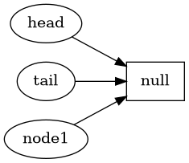

node1=new Node(1);

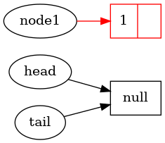
head=node1;
tail=node1;

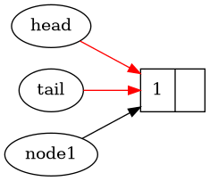

node1=new Node(2);

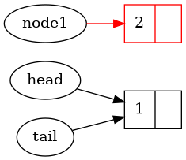

tail.next=node1;

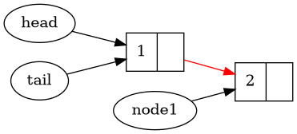

tail=node1;

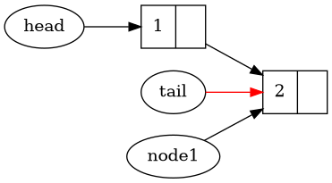

node1=new Node(3);

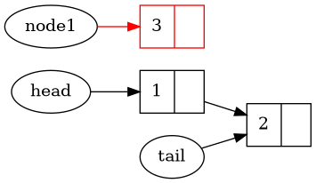
tail.next=node1

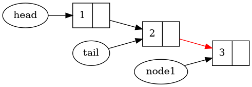

tail=node1

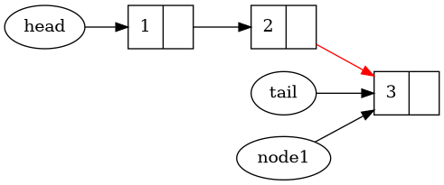

node1=new Node(4)

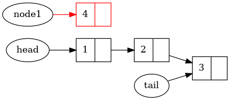

tail.next=node1

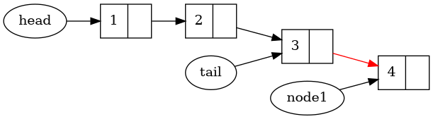

tail=node

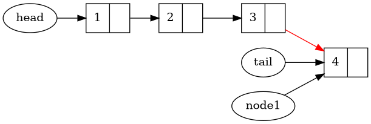

